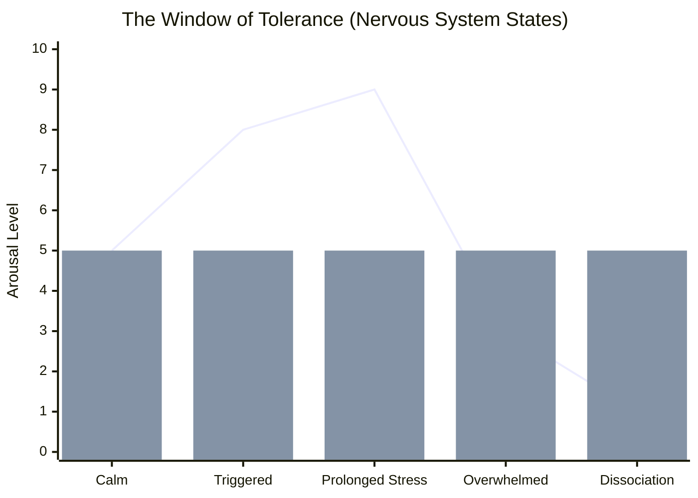
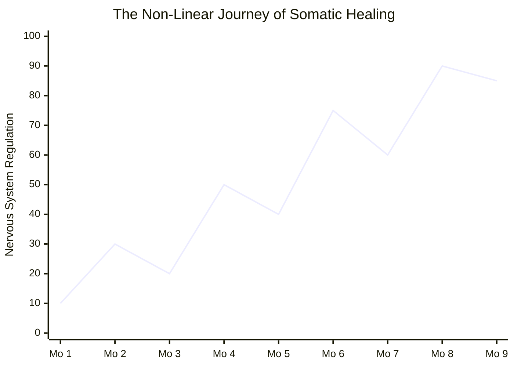

*The Body Keeps the Score* by Dr. Bessel van der Kolk is widely considered the modern bible of trauma recovery. It completely reframes how we understand deep psychological pain, shifting the focus from "what is wrong with your mind?" to "what has happened to your body?" 

If you browse online trauma recovery communities, you will see this book mentioned constantly. You will also see a common warning: **this book can be incredibly triggering**. Dr. van der Kolk details horrific abuse and trauma in the early chapters to prove his points. Many readers advise others to pace themselves, skip the clinical case studies if they become too overwhelming, and jump straight to the later chapters on healing. 

The consensus is clear: the book is profoundly life-changing. It offers an immense sense of validation. It proves that your symptoms are not moral failings; they are physiological responses to impossible situations.

This overview breaks down the book sequentially, highlighting the specific concepts and neurobiological explanations that the recovery community has found most impactful, accompanied by visual aids and approachable resources for deeper exploration.

## Part 1: The Rediscovery of Trauma

In the first part of the book, Dr. van der Kolk lays the historical groundwork for how trauma has been misunderstood. For decades, the psychiatric community treated trauma as a purely psychological issue: a bad memory that needed to be rationalized away. 

The breakthrough came with the realization that trauma is not just a memory of the past; it is an overwhelming experience that fractures the mind and traps the body in a perpetual state of emergency. When a traumatic event occurs, the body's natural defense mechanisms are thwarted. The threat is over, but the body behaves as if the danger is still present.

**The Community Insight:** 
For many readers, this section brings a wave of intense relief mixed with grief. A common sentiment among readers is the realization, *"I am not broken or evil; I am traumatized."* Readers express profound validation in learning that their chronic exhaustion, explosive anger, or total emotional numbness are documented, predictable responses to trauma. Having a clinical name for their experience allows them to finally stop blaming themselves.

### Helpful Links

* **Video:** [What is Trauma? The Author Explains](https://www.youtube.com/watch?v=53RX2ESIqsM) (A gentle 10-minute introduction to Dr. van der Kolk's core philosophy).

* **Article:** [Why You Can't Just 'Get Over' Trauma](https://www.psychologytoday.com/us/blog/the-body-keeps-the-score) (A digestible breakdown of how trauma imprints on us).

* **Podcast:** [The Trauma Therapist Podcast - Foundational Concepts](https://www.thetraumatherapistproject.com/podcast/) (Accessible interviews with trauma experts).

## Part 2: This is Your Brain on Trauma

This is where the book dives into heavy neuroscience, but it's also where readers experience some of the biggest "aha!" moments. 

Dr. van der Kolk explains the brain using a highly accessible metaphor:

* **The Amygdala (The Smoke Detector):** The primitive part of the brain that senses danger and sounds the alarm, flooding the body with stress hormones.

* **The Medial Prefrontal Cortex (The Watchtower):** The logical part of the brain that looks down from above and says, "That's not a real fire; it's just burnt toast."

In a traumatized brain, the smoke detector is hyper-sensitive, and the watchtower is offline. When triggered, the logical brain literally shuts down. This is called an **amygdala hijack**. 

*(The chart above illustrates the Window of Tolerance. The bar represents the optimal zone of regulation. Trauma pushes the body into hyperarousal (anxiety/panic, the peak) or hypoarousal (numbness/dissociation, the drop), making it impossible to process information logically.)*

**The Community Insight:** 
This section answers a massive, painful question for the CPTSD community: *"Why doesn't Cognitive Behavioral Therapy (CBT) work for me?"* Across support groups, users share stories of spending years in CBT trying to "think" their way out of a panic attack, only to feel like failures. The book explains why: you cannot reason with an offline watchtower. You have to calm the physical smoke detector first. Users frequently discuss how rumination isn't just "overthinking"; it is a physical loop that actively retraumatizes the nervous system.

### Helpful Links

* **Video:** [The Amygdala Hijack Explained](https://www.youtube.com/watch?v=FcsJiikpt90) (A simple animation showing how trauma shuts down logic).

* **Article:** [Understanding Your Window of Tolerance](https://www.mindmypeelings.com/blog/window-of-tolerance) (A great visual guide to hyperarousal and hypoarousal).

* **Podcast:** [Huberman Lab: The Neuroscience of Fear and Trauma](https://hubermanlab.com) (For those who want to dive deeper into the biology).

## Part 3: The Minds of Children

Part 3 explores developmental trauma and attachment. Dr. van der Kolk explains that our earliest relationships shape the literal wiring of our brains. Secure attachment provides a template for self-regulation; we learn to soothe ourselves because someone else consistently soothed us. 

When children experience chronic neglect or abuse from their caregivers, their brains adapt to a hostile world. They learn that people are dangerous and that their own needs do not matter. This creates a foundation of deep shame and an inability to form trusting relationships later in life.

**The Community Insight:** 
This section is often described as the most heartbreaking. Readers frequently discuss mourning the childhood they never had. The book validates a crucial point: emotional neglect is just as damaging to the developing brain as overt physical abuse. Many users report that this part of the book helped them finally recognize their parents' emotional absence as a profound trauma, rather than brushing it off with "well, they never hit me."

### Helpful Links

* **Video:** [Childhood Trauma and the Brain](https://www.youtube.com/watch?v=xYBUY1kZpf8) (A compassionate look at developmental trauma).

* **Article:** [The Invisible Scars of Childhood Emotional Neglect](https://drjonicewebb.com/about-childhood-emotional-neglect/) (A foundational resource on understanding what *didn't* happen to you).

* **Podcast:** [Therapy Chat: Attachment and Trauma](https://therapychatpodcast.com) (Discussions on healing early wounds).

## Part 4: The Imprint of Trauma

How does the body actually keep the score? Dr. van der Kolk introduces the **vagus nerve**, a massive nerve highway that connects the brain to the heart, lungs, and gut. 

When the brain perceives a threat, it sends signals down the vagus nerve to prepare the body to fight or flee (racing heart, shallow breathing, tense muscles). If fighting or fleeing isn't possible, the body enters a "freeze" state, leading to collapse and dissociation. In traumatized individuals, this system is perpetually misfiring. The body remains armored, braced for an attack that isn't happening. 

**The Community Insight:** 
Readers constantly point to this section as the moment their mysterious physical ailments made sense. People with CPTSD frequently suffer from chronic fatigue, fibromyalgia, migraines, and severe gastrointestinal issues. The book provides the missing link: these aren't random medical mysteries; they are the physical toll of a nervous system locked in overdrive. Validating "muscle armoring" (the subconscious clenching of the jaw, shoulders, and pelvic floor) is a frequent topic of discussion.

### Helpful Links

* **Video:** [Polyvagal Theory in Simple Terms](https://www.youtube.com/watch?v=br8-qebjIgs) (An excellent, approachable breakdown of the vagus nerve).

* **Article:** [Why Trauma is Stored in the Body](https://www.somatictraumatherapy.com/trauma-and-the-body/) (A guide to somatic symptoms).

* **Podcast:** [Stuck Not Broken](https://www.justinlmft.com/podcast) (A podcast entirely dedicated to applying Polyvagal Theory to everyday life).

## Part 5: Paths to Recovery

This is the most celebrated section of the book. Having established that trauma is a physical problem, Dr. van der Kolk outlines physical and relational solutions. He argues that traditional talk therapy is insufficient because it only engages the rational brain. True healing requires interventions that rewire the nervous system and help the body feel safe again.

*(The chart above reflects the reality of trauma recovery as described by the community: healing is not a straight line. Somatic interventions can cause temporary dips or emotional hangovers as the body processes stuck trauma, but the overarching trajectory leads to much higher baseline regulation.)*

**The Community Insight:** 
When readers say the book "changed their life," they are almost always referring to the specific therapies introduced in Part 5. 

* **EMDR (Eye Movement Desensitization and Reprocessing):** Users praise EMDR for its ability to take the "charge" out of traumatic memories. By using bilateral stimulation (eye movements or tapping), EMDR helps the brain file away stuck memories, moving them from the active smoke detector into the archives. While users warn it can be exhausting and cause "emotional hangovers," many credit it with saving their lives.

* **Neurofeedback:** This involves monitoring brainwaves and rewarding the brain for entering calmer states. Users report that neurofeedback feels like "magic" for quieting a racing mind and reducing chronic hypervigilance when nothing else worked.

* **Internal Family Systems (IFS):** Chapter 17 on IFS is a massive focal point online. IFS posits that the mind is made up of different "parts" (e.g., an angry protector part, an exiled wounded child part). Instead of fighting these parts, the goal is to "sit with" them and offer them compassion. Users report profound emotional breakthroughs from finally extending love to the parts of themselves they used to hate.

* **Yoga and Somatic Experiencing:** Learning to inhabit the body safely through mindful movement. For people who have spent their lives dissociating to survive, gentle, trauma-informed yoga is often the first step in re-learning how to feel their own heartbeat and breath without panic.

*The Body Keeps the Score* teaches that you cannot simply talk your way out of trauma. You must move it, breathe through it, and physically process it. For millions of readers, this has been the key that finally unlocked the door to a normal, regulated life.

### Helpful Links

* **Video:** [What an EMDR Session Actually Looks Like](https://www.youtube.com/watch?v=LjaBWPi1h00) (A great demystification of the process).

* **Article:** [An Introduction to Internal Family Systems (IFS)](https://ifs-institute.com) (The official, user-friendly guide to parts work).

* **Podcast:** [The One Inside: An IFS Podcast](https://theoneinside.libsyn.com) (Real conversations about applying IFS to heal deep wounds).

* **Video:** [Trauma-Sensitive Yoga with Adriene](https://www.youtube.com/watch?v=sTANio_2E0Q) (A gentle, 20-minute physical practice for nervous system regulation).
